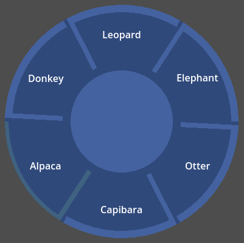

For Paracortical Initiative, 2025, Diogo "Theklo" Duarte

Other projects:
- [Bluesky for news on any progress I've done](https://bsky.app/profile/diogo-duarte.bsky.social)
- [Itchi.io for my most stable playable projects](https://diogo-duarte.itch.io/)
- [The Github for source codes and portfolio](https://github.com/Theklo-Teal)
- [Ko-fi is where I'll accept donations](https://ko-fi.com/paracortical)

# DESCRIPTION
A control node that displays a radial menu where sectors can be pressed as buttons as well as the center. It's useful as a quick and dirty option for prototyping, or if you want to build upon to make a more elaborate radial menu.

# INSTALLATION
This isn't technically a Godot Plugin, it doesn't use the special Plugin features of the Editor, so don't put it inside the "plugin" folder. The folder of the tool can be anywhere else you want, though, but I suggest having it in a "modules" folder.

After that, the «class_name RadialMenu» registers the node so you can add it to a project like you add any Godot node.
Three example scenes are provided to demonstrate features and extensibility. One has an animated background, the other mimics modern application menus and one is a revolver cylinder diagetic that could be used as ammo indicator in a shooting game.

# USAGE
You may set what to display in the menu by adding children, this will create "sectors", usually would be a Label node. Caveats:
- You might need to set `mouse_filter` in the children to "ignore".
- Size flags on the children affect their positioning.
- There isn't a way to have nodes in the center, but you can display images by overriding `draw_center_*()` with `draw_texture()`or `draw_texture_rect()`.

You then may have a script extending RadialMenu to override how background or sectors are drawn, as well as the center button.
Several functions like `get_sector_corners()` or `get_sector_center()`, as well as variables like `center` and `central_radius` allow you to make your own drawings without needing to do any math.
When a sector or the center are pressed, they both emit a signal and call related functions you may override.

# TIPS
Look for the "Utility" and "Helper" function regions in the code that may be useful in for your overriding purposes.
Don't forget that Godot's `draw_*` are very varied. You can draw textures, StyleBoxes and even render text.
If you want to have the menu remember the last pressed sector, as in toggle it like Button nodes, just add a variable "pressed_item" and check for that in the `_draw_sector_normal()` function.

# FUTURE IMPROVEMENTS
- Drawing is not correct when the node is first instanced, but next time it re-draws things get fixed.

